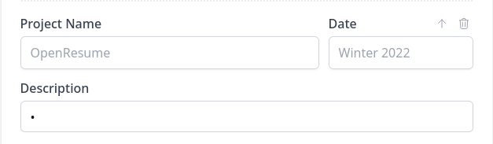
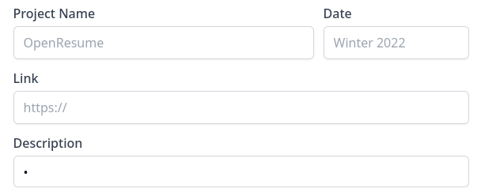
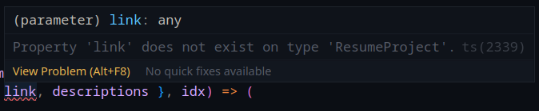
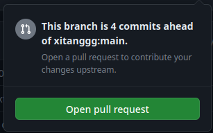
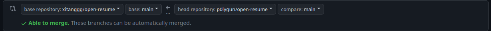
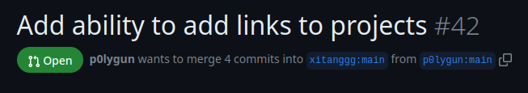

> Huh, a resume ? That's easy, bro ?  
> Famous last words




As I am in the final year of college, I set out to build a [resume](), Going into it, I thought it is going to be an easy journey. **I was So Wrong**  

There is a lot that goes into building a good and effective resume... but that's a story for another day.

Today, we are talking about how to contribute to an Open-source Project.  
I usually find a lot of students telling me that they want to contribute to projects, but they are 
- Not able to find projects to contribute
- Don't Know the language/Framework that the project uses

Now, I am going to show you Why both of the problems are actually not problems but just **The Way you think about Open-Source Projects**


## The project

So let's go back to me making the resume... my hunt for a good template lead me to [OpenResume](https://www.open-resume.com/), 

### Open Resume


> The goal of OpenResume is to provide everyone with free access to a modern professional resume design and enable anyone to apply for jobs with confidence.


An awesome "Open Source" project that helps students and professional build resumes that pass filters of almost all [ATS](https://en.wikipedia.org/wiki/Applicant_tracking_system) frameworks. 

This project checked all the marks (well, almost) I was looking for, 
It has a good form to build the resume, good UI, good template. 


Not only that, it also has a [Resume Parser](https://www.open-resume.com/resume-parser), which helps you understand how your resume will be against an ATS.

Which brings me to my next point.

### How to find a project

To find a project you don't need to think too much, here are two straight
forward ways.

- Use more open source software
	- As you use more and open source software, sooner or later you are going to run into bugs, will want new features, will spot typos
	- Every single one of those is an opportunity to contribute to the project.
- Make use of [GitHub Issues](https://github.com/issues)
	- Did you know you can actually search issues on all public repos on GitHub ?, well we use that to find issue in projects that we can help with !!
	- Head over to [Issues](https://github.com/issue), and look at the search bar, it will say something like `is:open is:issue author:p0lygun archived:false `
	- We can use GitHub advance search parameters to search for issues.
	- Use Keywords like `langauge:`, `lable:`
		- Some of the ones I use are
			- `is:open is:issue archived:false language:python label:"help wanted"` (Gets all issues in repo that use python and has label help wanted)
			- another good one is `is:open is:issue archived:false language:python label:"good first issue" `

## The Problem

While the project is good, there is a big flaw in it. You can't add links to your projects ☠️, Which was a **major** requirement for me.

Now I can do two things, 
- give up and look for another template/project
- contribute to the project and add the feature.

It's no brainier, we contribute :).


## Contributing 

Now that we have solved the **"Where to contribute"** problem, we go to the next problem, i.e : Don't Know the language/Framework that the project uses,

Well, the answer is you don't need to 😄,  



Yh, you don't really need to learn a whole new framework or a language to contribute to opensource, as long as you have a language and google in your hand !!

> The trick is, that we don't care about the whole thing, we only care about the feature we want to implement :)

To show why this is true, let's go back to the feature I want to implement, 
The project uses React and Next.js and out of those I know.... neither ☠️

But that does not matter because I know

- how to read code
- what I need to do
- project structure

**All these are True for you too !!!**

So let get to contributing, 

First, we clone and `cd` into the project now, we can clearly see that the "Resume Builder" project is split into two, 
- The Form
- The Resume
This also reflects in the [Resume Components](https://github.com/xitanggg/open-resume/tree/main/src/app/components) directory
```d
.
├── documentation 
├── Resume
├── ResumeForm
├── Button.tsx
├── ExpanderWithHeightTransition.tsx
├── FlexboxSpacer.tsx
├── ResumeDropzone.tsx
├── Tooltip.tsx
└── TopNavBar.tsx
```

We only care for `ResumeForm` and `Resume` Components, upon looking further we find our Form Component in `ResumeForm`

```d
.
├── Form
├── ThemeForm
├── CustomForm.tsx
├── EducationsForm.tsx
├── index.tsx
├── ProfileForm.tsx
├── ProjectsForm.tsx  ( This is what we want )
├── SkillsForm.tsx
├── types.ts
└── WorkExperiencesForm.tsx
```

So we found the component that is responsible for the "Projects" part of the resume, it currently renders as, 



Now we want to add a new field "Links" to this, if we look at the component in `ProjectsForm.tsx`, we find the fields defined in for the component, 

So a little bit of copy-pasting, and we just add this in the fields, 
```tsx
	<Input
	  name="link"
	  label="Link"
	  placeholder="https://"
	  value={link}
	  onChange={handleProjectChange}
	  labelClassName="col-span-full"
	/>
```
Now we also need to add `link` to the function declaration, so let's do that too
```diff
-{projects.map(({ project, date, descriptions }, idx) => (
+{projects.map(({ project, date, link, descriptions }, idx) => (
```
By doing that, we see that the component in the "Form" has now updated, 



We Have Link in **Form**..., Halfway there..... Now time to update the resume builder, 

Let's look in the `Resume` directory, Inside that we find `ResumePDF` component directory, and inside that we finally find what we need, `ResumePDFProject.tsx`

Now we just need to do two things, 
- Update `ResumeProject` type so that is an additional attribute called `links`
- Add `ResumePDFLink` to finally have clickable links in PDF !!!

Right now, if we try to run the project, we will get this 

We can see that `ResumeProject` type is defined in `lib/redux/types`, so let's add the type `link` to `ResumeProject` class, 
so that gives us, 
```ts
export interface ResumeProject {
	project: string;
	date: string;
	link: string;
	descriptions: string[];
}
```

Easy rht ? You have come far... let's take some rest and enjoy this meme



ok let's get back to work, we are almost there, Let's add `ResumePDFLink` to `ResumeProject`

```tsx
<View style={{
...styles.flexRow,
alignItems: "center",
gap: spacing["1"],
}}>
<ResumePDFLink src={link} isPDF={isPDF}>{
<ResumePDFText bold={true}>{project}</ResumePDFText>
}</ResumePDFLink>
{link && <ResumePDFIcon type="url" isPDF={isPDF}></ResumePDFIcon>}
</View>
```

This code creates a new `View` in that we have a `ResumePDFLink` that contains the `ResumePDFText`, while we are at it we can also add a icon to showcase that the "Project Title" is a clickable link, 

Doing this gives us....


Awesome, just what we wanted..., now all that is left is to commit and make a new PR !!!

As this project does not have a set "commit" format, we can do it any way, I personally use my own [`commit-msg`](https://github.com/p0lygun/commit-msg-validator) format for all commits, 

So a few git commits we are ready to create the PR, 







And Just like that we have our [Pull request](https://github.com/xitanggg/open-resume/pull/42) with the new feature implemented 🎉🎉🎉



## Conclusion

So as we just saw Contributing to open source projects is quite easy
**we don't need to know the neither the project nor all the frameworks used in it** 

If you would like more projects to contribute, may I recommend one ? 
It's [bfportal.gg](https://bfportal.gg/), a platform that I created so that players in battlefield could share custom game modes made in battlefield portal,

we use a very simple stack (Django, TailwindCSS... that's it), and is a good beginner project, You can find the repository at [gh.bfportal.gg](https://gh.bfportal.gg/)

