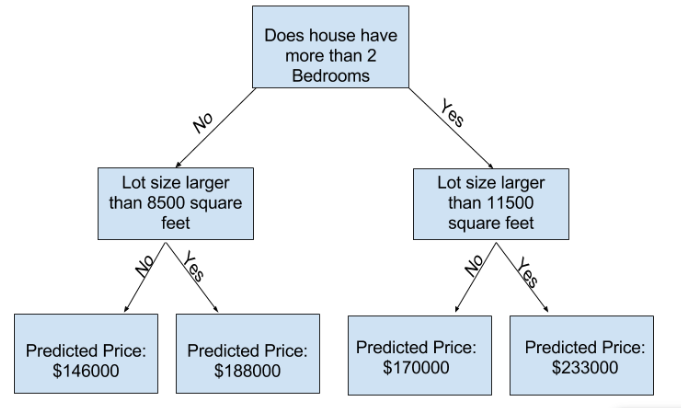

As time goes, I find myself more and more fascinated by **Machine Learning**.  
So I figured it's about time I start learning it.

I am starting with a free course provided by [kaggle](https://www.kaggle.com/code/dansbecker/how-models-work).

## Notes
### Chapter 1 
- Capturing patterns from data is called **fitting** or **training** the model. 
- The data used to **fit** the model is called the **training data**
- A decision tree
-  The point at the bottom where we make a prediction is called a **leaf.**
## Chapter 2 (Basic Data Exploration)
- Use pandas